# Artemis Banking Pro

Plataforma bancaria en ASP.NET Core 9 con arquitectura Onion y CQRS. Incluye una **WebApp MVC** para administradores, cajeros y clientes, una **WebAPI REST** con JWT para administradores y comercios (con el procesador de pagos Hermes Pay), una **Azure Function** programada para marcar cuotas vencidas, y 339 pruebas unitarias y de integración.

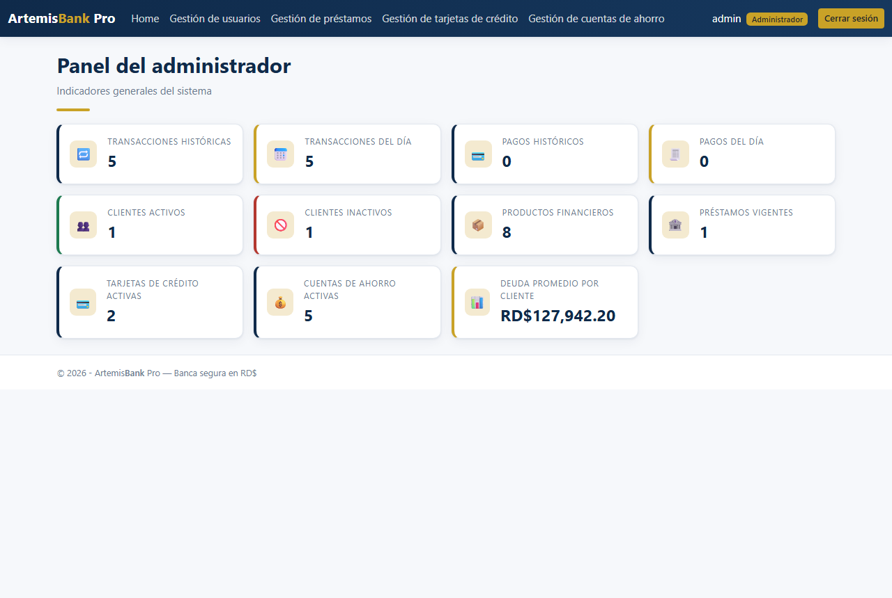

## WebApp

**Administrador**

- Panel con transacciones y pagos históricos y del día, clientes activos e inactivos, productos financieros, préstamos vigentes, tarjetas y cuentas activas, y deuda promedio por cliente.
- Gestión de usuarios: listado paginado con filtro por rol, creación de administradores, cajeros y clientes con validación de usuario, correo y cédula únicos. Al crear un cliente se abre su cuenta de ahorro principal y el monto inicial queda registrado como crédito. Activación e inactivación sin permitir modificar la propia cuenta.
- Préstamos: asignación solo a clientes activos sin préstamo vigente, aviso de alto riesgo cuando la deuda supera el promedio del sistema, cuota bajo sistema francés, tabla de amortización, desembolso a la cuenta principal y edición de tasa recalculando solo las cuotas pendientes.
- Tarjetas de crédito: número único de 16 dígitos, expiración y CVC almacenado como hash, visualización enmascarada, detalle con consumos aprobados y rechazados, edición de límite y cancelación solo sin deuda.
- Cuentas de ahorro: cuentas secundarias con balance inicial, detalle con historial y cancelación que transfiere el balance a la cuenta principal con registro cruzado.

**Cliente**

- Home con cuentas, préstamos y tarjetas activos, y detalle de cada producto.
- Beneficiarios validando que la cuenta exista, esté activa y no sea propia.
- Transacción Express, transferencia entre cuentas propias, pago a beneficiarios, pago de tarjeta sin sobrepago, pago de préstamo aplicando cuotas en orden y avance de efectivo con interés del 6.25%. Cada operación pide confirmación y envía correo.

**Cajero**

- Indicadores del día, depósito, retiro con validación de fondos, pago a tarjeta, pago a préstamo y transacciones a terceros, todas con confirmación previa y asociadas al cajero autenticado.

**Seguridad**

- Login con validación de credenciales, usuario activo y rol permitido; activación de cuenta y restablecimiento de contraseña con tokens de un solo uso; acceso denegado por rol; seed de roles y usuarios.

## WebAPI

Documentada en Swagger con autenticación Bearer. Errores en formato Problem Details (RFC 7807) mediante un manejador global de excepciones.

| Módulo | Endpoints | Acceso |
|---|---|---|
| Account | `POST /account/login`, `confirm`, `get-reset-token`, `reset-password` | Público |
| Users | `GET /api/users`, `GET commerce`, `GET {id}`, `POST`, `POST commerce/{commerceId}`, `PUT {id}`, `PATCH {id}/status` | Administrador |
| Loan | `GET /api/loan`, `GET {id}`, `POST`, `PATCH {id}/rate` | Administrador |
| Credit card | `GET /api/credit-card`, `GET {id}`, `POST`, `PATCH {id}/limit`, `PATCH {id}/cancel` | Administrador |
| Savings account | `GET /api/savings-account`, `POST`, `GET {accountNumber}/transactions`, `PATCH {accountNumber}/cancel` | Administrador |
| Commerce | `GET /api/commerce`, `GET {id}`, `POST`, `PUT {id}`, `PATCH {id}/status` | Administrador |
| Hermes Pay | `GET /pay/get-transactions/{commerceId}`, `POST /pay/process-payment/{commerceId}` | Administrador y Comercio |

Un cliente o cajero que intenta autenticarse recibe 403, un token ausente o inválido 401, y un comercio usa el `commerceId` de su propio JWT.

## Capturas

| Inicio de sesión | Gestión de usuarios |
|---|---|
| 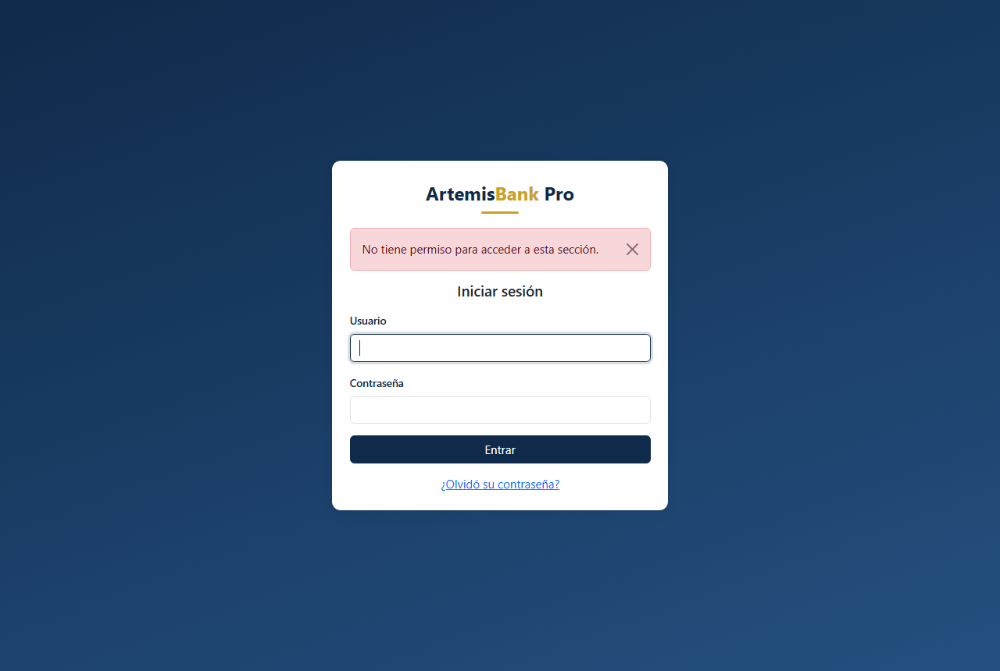 | 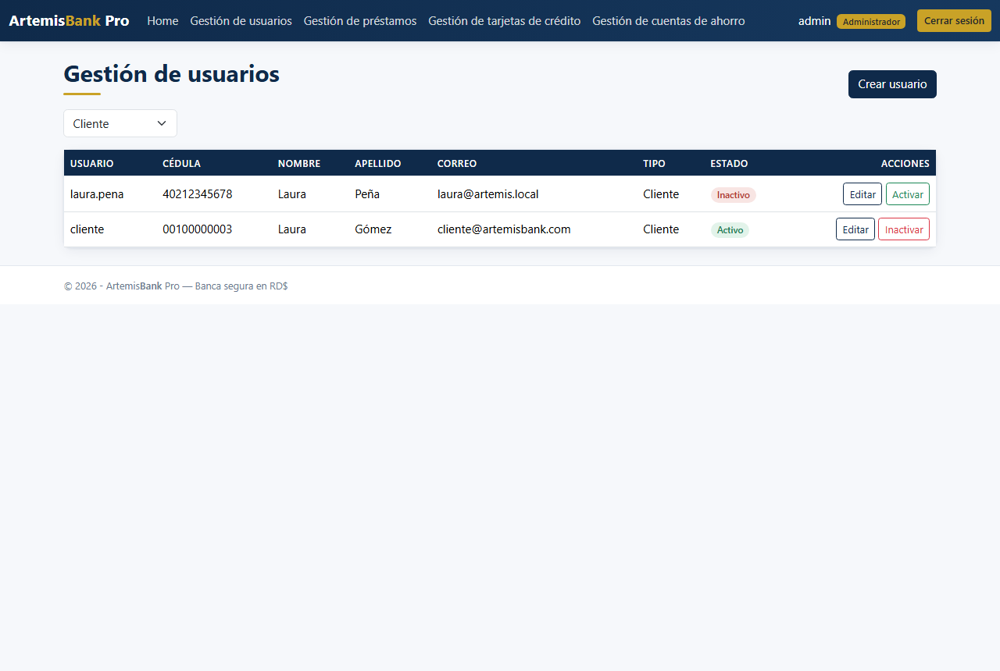 |

| Préstamo con tabla de amortización | Detalle de tarjeta |
|---|---|
| 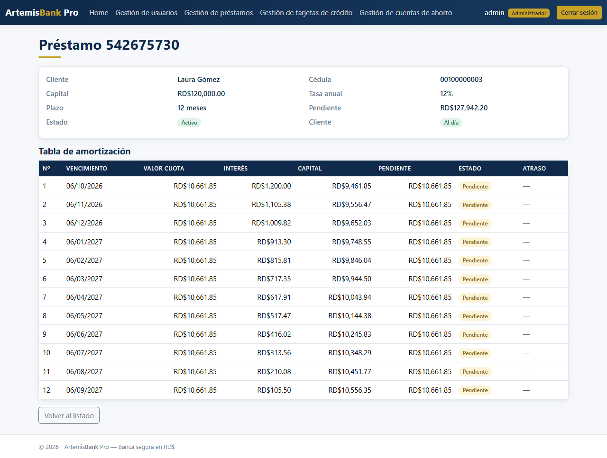 | 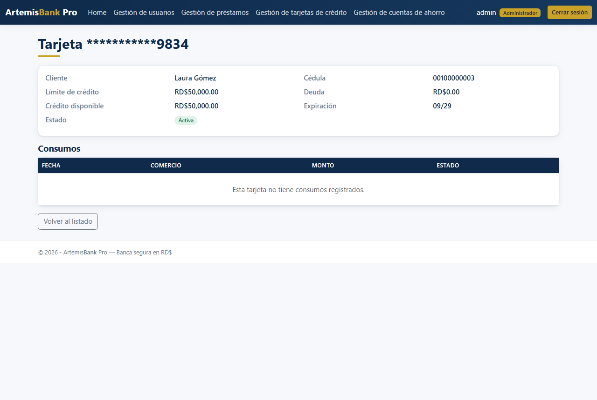 |

| Home del cliente | Beneficiarios |
|---|---|
| 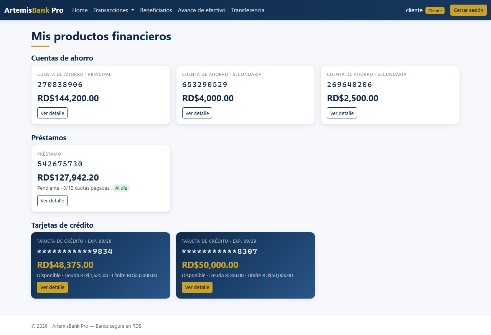 | 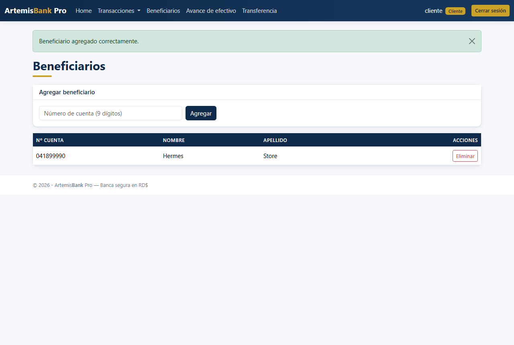 |

| Confirmación de transacción | Home del cajero |
|---|---|
| 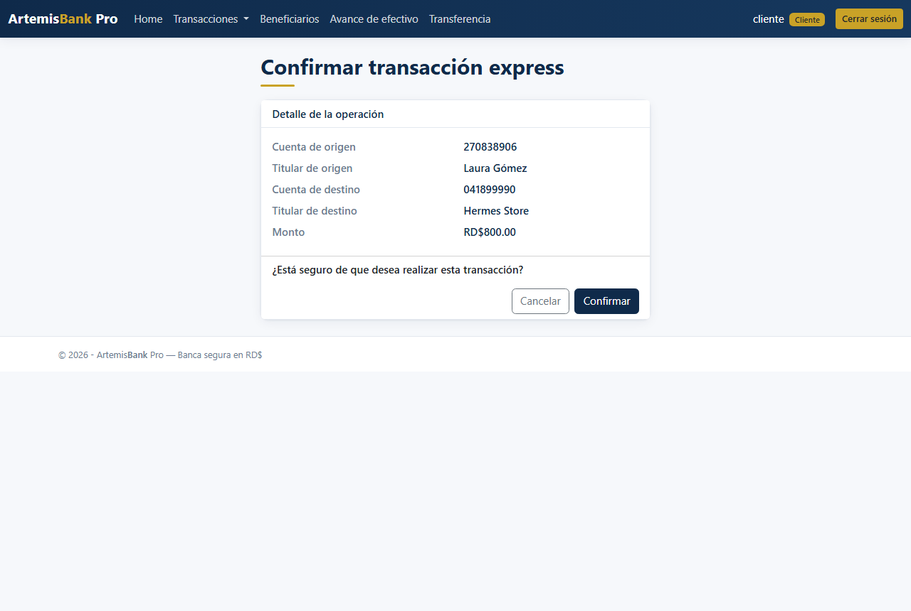 | 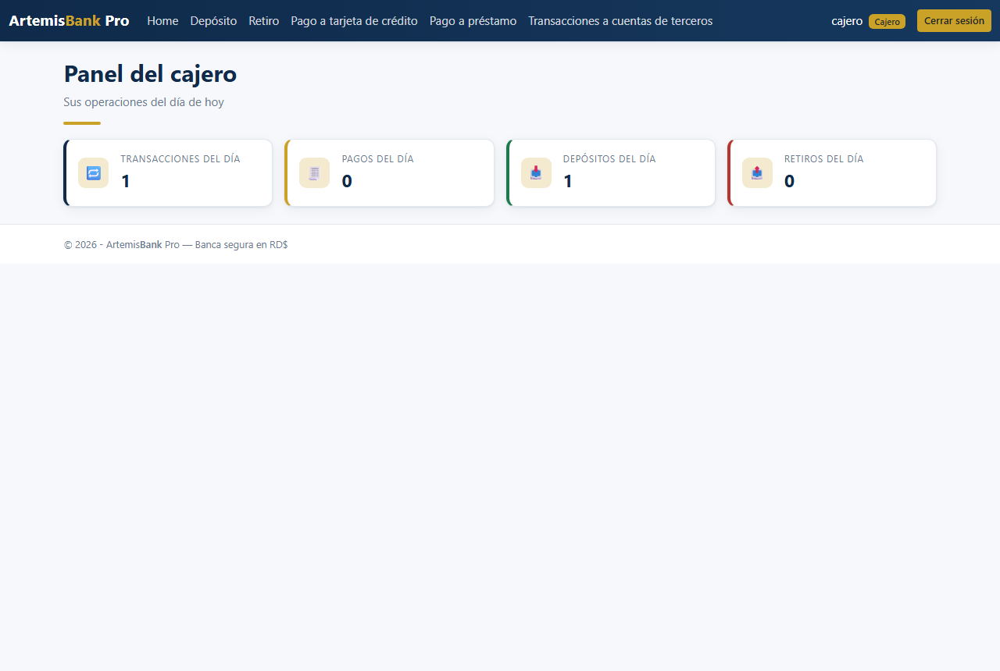 |

| Acceso denegado | Swagger de la WebAPI |
|---|---|
| 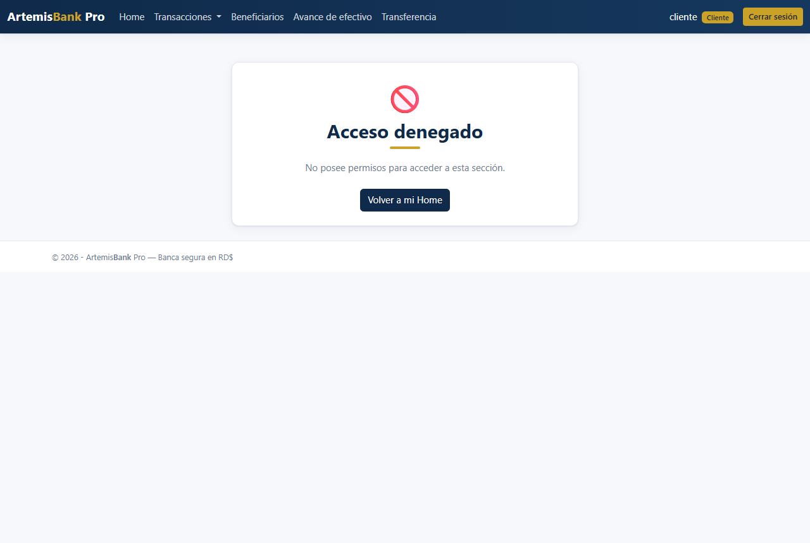 | 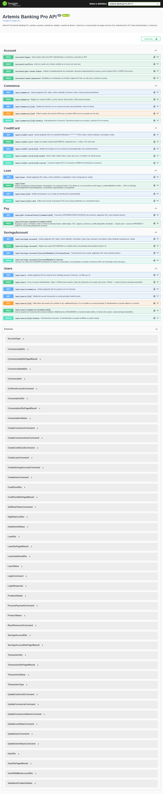 |

## Arquitectura

```
ArtemisBankingPro.sln
├── ArtemisBankingPro.Core.Domain               Entidades, enums y constantes
├── ArtemisBankingPro.Core.Application          CQRS con MediatR: Commands, Queries, validadores FluentValidation,
│                                               Behaviors, DTOs, interfaces, perfiles de AutoMapper y servicios de negocio
├── ArtemisBankingPro.Infrastructure.Persistence DbContext, configuraciones, repositorios genéricos y específicos, migraciones y seed
├── ArtemisBankingPro.Infrastructure.Identity   Identity en esquema propio, JWT, tokens de verificación y seed de usuarios
├── ArtemisBankingPro.Infrastructure.Shared     Correo (MailKit), hashing y generador de números de producto
├── ArtemisBankingPro.WebApp                    MVC con ViewModels, Serilog y cookies de Identity
├── ArtemisBankingPro.WebApi                    Controladores REST, Swagger, JWT, Problem Details y Serilog
├── ArtemisBankingPro.Functions                 Azure Function con temporizador que marca cuotas vencidas
├── ArtemisBankingPro.Tests.Unit                292 pruebas: Commands, Queries, validadores, Behaviors y servicios
└── ArtemisBankingPro.Tests.Integration         47 pruebas: repositorios y flujos transaccionales con SQLite en memoria
```

- Toda salida de dinero es un DÉBITO y toda entrada un CRÉDITO; las transferencias registran ambos movimientos y las operaciones que tocan varias entidades corren en una transacción.
- Montos en `decimal` con precisión de centavos. El historial se conserva aunque se inactiven usuarios o se cancelen productos.
- Serilog escribe en consola y en archivo con rotación diaria, sin datos sensibles.
- Correo: con SMTP configurado envía por MailKit. Sin configurar, guarda cada correo como HTML en `App_Data/correos` del host, lo que permite probar activaciones y notificaciones en desarrollo.

## Cómo ejecutarlo

Requisitos: SDK de .NET 9 y SQL Server. La cadena de conexión por defecto apunta a `localhost\MSSQLSERVER01`; ajústela en `appsettings.json` de ambos hosts o con la variable de entorno `ConnectionStrings__DefaultConnection`.

```bash
git clone https://github.com/MarioMahir/ArtemisBankingPro.git
cd ArtemisBankingPro
dotnet dev-certs https --trust
dotnet run --project ArtemisBankingPro.WebApp --launch-profile https
dotnet run --project ArtemisBankingPro.WebApi --launch-profile https
dotnet test
```

Al arrancar, cada host aplica las migraciones y siembra roles, usuarios y productos iniciales:

| Rol | Usuario | Contraseña |
|---|---|---|
| Administrador | `admin` | `Artemis123$` |
| Cajero | `cajero` | `Artemis123$` |
| Cliente | `cliente` | `Artemis123$` |
| Comercio | `comercio` | `Artemis123$` |

WebApp: https://localhost:7139. WebAPI y Swagger: https://localhost:7233/swagger.

```bash
curl -k -X POST https://localhost:7233/account/login \
  -H "Content-Type: application/json" \
  -d '{"userName":"admin","password":"Artemis123$"}'
```

La Azure Function se ejecuta localmente con Azure Functions Core Tools desde `ArtemisBankingPro.Functions` (`func start`); su cadena de conexión está en `local.settings.json`.

### Correo real (opcional)

Las credenciales no están en el repositorio. Configúrelas con user-secrets en cada host (`EmailSettings:SmtpHost`, `SmtpPort`, `SmtpUser`, `SmtpPassword`, `FromAddress`). Con Gmail se necesita una contraseña de aplicación. La clave JWT de `appsettings.json` es solo para desarrollo.

## Stack

ASP.NET Core 9 MVC y Web API, ASP.NET Core Identity, JWT Bearer, Entity Framework Core 9 (Code First, SQL Server), MediatR, FluentValidation, AutoMapper, Serilog, MailKit, Swagger, Azure Functions (isolated), xUnit, Moq y SQLite en memoria para pruebas.

## Contexto

Proyecto final del módulo de Programación III (ITLA, 2026).
